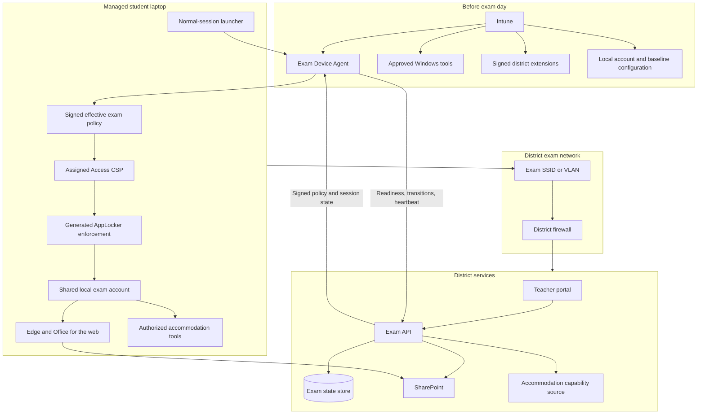
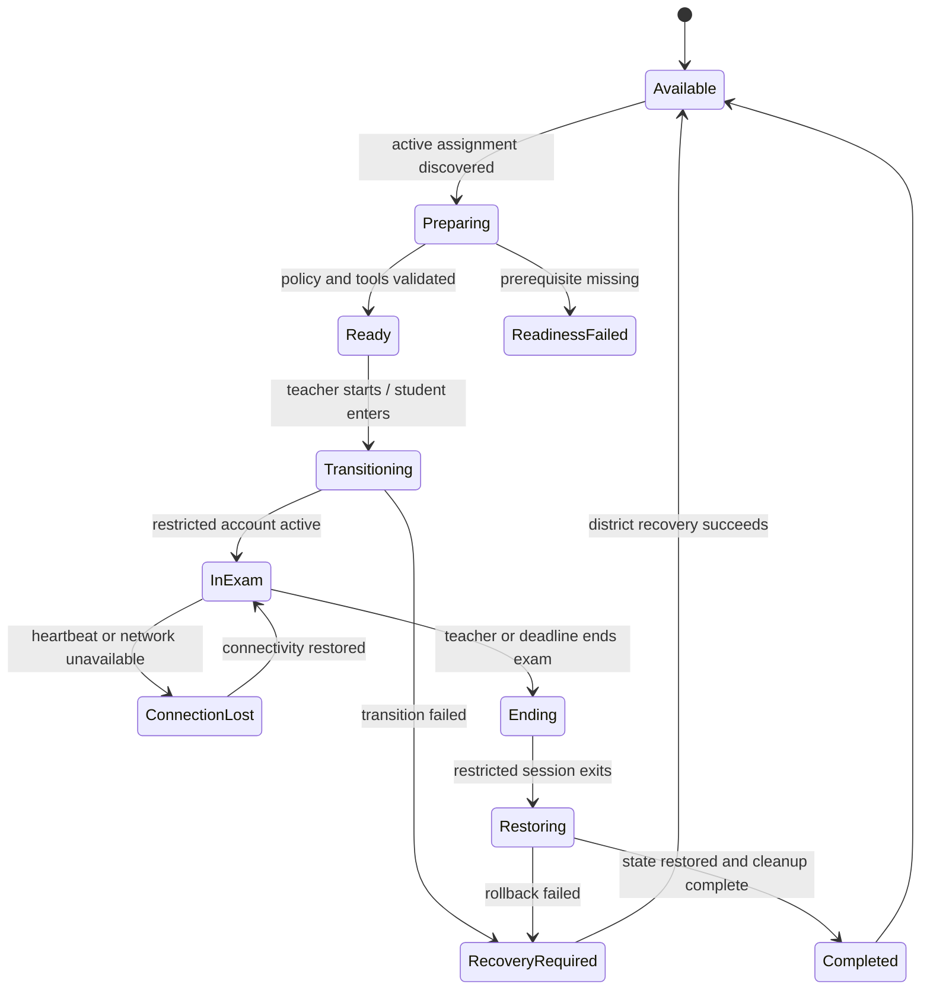

# Exam Kiosk Prototype Development Plan

> [!WARNING]
> This document describes an experimental prototype. The proposed toolkit is
> not production-ready, is not a certified exam-security product, and must not
> be represented as preventing every form of cheating, data loss, device
> escape, or service disruption.

## 1. Purpose

Build a toolkit that lets school districts run controlled, in-person exams on
district-managed Windows laptops. Students work primarily in Office documents
stored in SharePoint and edited with Office for the web. The toolkit moves a
laptop from the student's normal Windows session into a restricted local exam
session and exposes only the applications and web tools authorized for that
student.

The prototype should prove:

- An end-to-end teacher and student exam workflow.
- A reliable transition into and out of a restricted Windows session.
- Direct editing of Office documents in SharePoint with autosave.
- Per-student accessibility and accommodation tools.
- Teacher visibility into student exam-session state.
- Exam-day activation without waiting for Intune policy synchronization.
- A district-extensible model for preinstalled Windows tools and scripts.

## 2. Scope and Assumptions

### In scope

- District-owned or fully Intune-managed Windows laptops.
- Students without local administrator rights.
- Exams taken on a district campus.
- A dedicated exam SSID or VLAN protected by the district firewall.
- A shared local standard account for the restricted exam session.
- Microsoft Edge, SharePoint, and Office for the web as the standard workspace.
- Preinstalled Windows applications and approved browser tools for
  accommodations.
- District IT-authored and approved extension packages.
- OS-enforced application allowlisting.
- Online operation with tolerance for brief network interruptions.

### Out of scope for the prototype

- Personally owned or unmanaged devices.
- Off-campus exams on untrusted networks.
- Deployment of new applications during an exam.
- Arbitrary scripts uploaded by teachers or downloaded from the exam API.
- Guaranteed offline editing or submission.
- A claim that the system prevents help from another physical device.
- Production-grade high availability, certification, or regulatory compliance.
- Replacing district identity, student-information, accommodation, network, or
  device-management systems.

## 3. Confirmed Architecture Decisions

| Area | Decision |
| --- | --- |
| Device management | Intune provisions the baseline ahead of time; it is not the exam-day control channel. |
| Runtime control | A privileged local Exam Device Agent applies and restores exam-session configuration. |
| Windows session | A shared local standard account runs the restricted exam session. |
| Workspace | Students edit Office documents directly in SharePoint through Office for the web. |
| Autosave | Office for the web and SharePoint provide autosave; no separate file synchronization layer is planned. |
| Application control | Assigned Access defines the restricted experience and generates AppLocker rules from the allowed application list. |
| GPO dependency | The toolkit does not depend on district domain GPOs. Windows may internally enforce policies associated with Assigned Access. |
| Accommodations | A signed effective exam policy maps student capabilities to preinstalled district extensions. |
| Script ownership | District IT authors, reviews, signs, and deploys custom extensions. |
| Exam-day installation | All tools and extensions are installed before exam day. |
| Network boundary | A dedicated exam SSID or VLAN and district firewall provide the main egress boundary. |
| Browser control | Temporary Edge policies constrain browser behavior and expose only approved web destinations. |
| Network switching | The local agent restricts alternate Wi-Fi, hotspot, cellular, Bluetooth networking, and unapproved adapters during the exam. |
| Monitoring | Explicit client state and heartbeat events drive the teacher dashboard. |

## 4. High-Level Architecture



The [original high-level architecture diagram](high-level-architecure.pdf)
is retained as the source design artifact. The Mermaid diagram above is the
evolving logical architecture.

### Recommended implementation stack

Application and automation code should use .NET or PowerShell. The recommended
starting stack is:

| Component | Technology |
| --- | --- |
| Exam Device Agent | .NET 10 Worker Service hosted as a Windows Service |
| Normal-session launcher | WPF on .NET 10 |
| Restricted exam client | WPF on .NET 10 |
| Teacher portal | ASP.NET Core Blazor Web App on .NET 10 |
| Exam API | ASP.NET Core Web API on .NET 10 |
| Background service jobs | .NET 10 Worker Services |
| Shared contracts and policy models | .NET class libraries using `System.Text.Json` |
| Assigned Access XML generation | .NET using `XDocument` or `XmlWriter` |
| SharePoint integration | Microsoft Graph SDK for .NET |
| State-store access | Entity Framework Core with the database provider selected during implementation |
| Windows client-to-agent IPC | Authenticated named pipes with explicit access control |
| Packaging | WiX Toolset MSI or Intune Win32 packaging for machine-wide installation |
| Provisioning, diagnostics, and recovery automation | Signed PowerShell scripts deployed and controlled by district IT |

The two WPF clients are separate executables because they run in different
Windows accounts and at different stages of the workflow. They may share .NET
libraries for contracts, validation, logging, and IPC, but they must not share
student credentials or Microsoft 365 tokens across sessions.

The Exam Device Agent must not host interactive UI. It runs as a Windows
Service, with only operations that require the MDM Bridge executing as
`LocalSystem`. WPF clients send narrowly scoped requests over authenticated
IPC, and the agent independently authorizes and validates every request.

PowerShell is reserved for installation, Intune detection and remediation,
feasibility testing, diagnostics, and administrator recovery. The API must
never provide arbitrary PowerShell for the agent to execute as `SYSTEM`.

## 5. Component Responsibilities

### Teacher portal

- Create an exam and define its schedule.
- Upload or select source Office documents.
- Assign students or a class roster.
- Review effective accommodations without exposing unnecessary diagnostic data.
- Start and end an exam.
- Display device readiness and student session states.
- Allow authorized recovery actions and individual time extensions in a later
  phase.

### Exam API

- Authenticate and authorize teachers and students.
- Maintain the authoritative exam lifecycle.
- Integrate with SharePoint to prepare student workspaces and permissions.
- Resolve functional accommodation capabilities from the district source.
- Produce a signed, short-lived, device-bound effective exam policy.
- Reject expired or replayed policies.
- Receive state transitions and heartbeats from device agents.
- Trigger SharePoint permission revocation when an exam ends.

### Exam state store

The state store, rather than SharePoint activity, is authoritative for workflow
state. It should track at least:

- Exam and schedule.
- Teacher and roster assignments.
- Student exam assignment.
- Device and active session.
- Effective policy version.
- SharePoint workspace reference.
- Current lifecycle state and last heartbeat.
- Start, end, recovery, and failure events.

### SharePoint integration

- Create or prepare one isolated working location per student and exam.
- Copy or provision the teacher's source documents.
- Grant each student access only to their workspace.
- Grant appropriate teacher access across student workspaces.
- Preserve document versions and Office autosave behavior.
- Revoke student access when the exam ends while retaining teacher access.

SharePoint permissions are a content authorization layer, not the complete exam
state machine. Revoking access also cannot erase content already downloaded or
cached on a disconnected device.

### Normal-session launcher

- Run in the student's normal Windows session.
- Authenticate the student and find the active exam assignment.
- Request the effective policy from the API.
- Show readiness and transition status.
- Ask the privileged agent to prepare the exam session.
- Never pass the student's password or Microsoft 365 token to the local exam
  account.

### Exam Device Agent

The agent is a preinstalled Windows service running with the minimum privileges
needed to apply device configuration. Operations requiring the MDM Bridge must
run as `LocalSystem`.

Responsibilities include:

- Validate policy signature, issuer, expiry, device binding, and nonce.
- Resolve policy capabilities to locally installed extension manifests.
- Run bounded extension readiness and activation hooks.
- Generate a student-specific Assigned Access `AllAppList` profile.
- Apply the profile through the MDM Bridge WMI provider.
- Apply temporary Edge and network restrictions.
- Journal every transition before changing device state.
- Switch from the normal session to the shared local exam account.
- Report readiness, transitions, failures, and heartbeats.
- Restore prior state after completion, expiry, crash, or reboot.

The agent is an actuator. The signed policy and backend lifecycle are the
authority.

### Restricted exam client

The restricted session needs a small client or launcher that:

- Starts automatically in the shared local exam account.
- Correlates the local session with the prepared exam assignment.
- Opens Edge at the exam entry URL.
- Exposes only the student's authorized tools.
- Reports `InExam`, connectivity, ending, and exit state.
- Polls or receives changes to authoritative exam state.
- Provides a controlled end-of-exam experience.

## 6. Effective Exam Policy

The API calculates the effective policy from:

```text
Exam defaults
  + student assignment
  + approved functional accommodations
  + district capability mappings
  = effective exam policy
```

The policy should contain identifiers and functional permissions, not medical
diagnoses. Example capabilities include:

- `dictionary`
- `textToSpeech`
- `dyslexiaReader`
- `calculator`
- `extraTime`

Conceptual policy fields:

- Policy, exam, assignment, student, and device identifiers.
- Issued-at and expiry timestamps.
- Unique nonce or replay identifier.
- SharePoint exam entry URL or opaque workspace reference.
- Authorized capabilities.
- Authorized browser destinations.
- Session deadline and any additional-time allowance.
- Policy schema and version.
- Digital signature and signing-key identifier.

A required accommodation that is missing or not ready must block exam entry and
produce a visible readiness failure. The system must not silently fall back to
the standard profile.

### Resolved prototype policy model

The prototype uses complete backend-owned definitions rather than fixed client
capability enums. Its durable model separates:

- student identity and exam assignments;
- exam metadata and the authoritative SharePoint folder;
- desktop, packaged, and Web tool definitions;
- applications required for enforcement, including unpinned helper processes;
- native and Web launch targets;
- exact Edge blocklist and allowlist values;
- generated Assigned Access and shortcut artifacts;
- the immutable effective profile stored with an exam session.

An `ExamSession` has a unique identifier, normalized student identity,
assignment, immutable effective profile, issue and expiry timestamps, and a
lifecycle state. The current lifecycle contract includes `Starting`, `Active`,
`Completing`, `Completed`, `Cancelled`, and `Expired`.

The API is authoritative for assignment ownership, session lifecycle, exam
metadata, and URLs. The Device Agent persists only the enforcement receipt and
local information required to reconcile or undo Windows changes.

## 7. District Extension Model

Each approved tool is represented by a signed, versioned package installed
before exam day. The server authorizes capabilities; the local package defines
how a district satisfies that capability.

Conceptual manifest fields:

```yaml
id: district.dyslexia-reader
version: 1.0.0
capability: dyslexiaReader

apps:
  - type: desktop
    path: C:\Program Files\DistrictTools\Reader\Reader.exe
  - type: desktop
    path: C:\Program Files\DistrictTools\Reader\ReaderHelper.exe

webDestinations:
  - reader.example.edu

hooks:
  readiness: Test-Ready.ps1
  activate: Activate.ps1
  deactivate: Deactivate.ps1
  cleanup: Cleanup.ps1
```

The final schema remains to be designed.

### Extension safety requirements

- Packages are authored and approved by district IT.
- Packages and manifests are signed and verified locally.
- New code is not downloaded during an exam.
- Hooks have strict timeouts and structured results.
- Hooks are idempotent and define rollback behavior.
- Hooks cannot modify the signed effective policy.
- Hooks do not receive student passwords or reusable tokens.
- Hooks log operational status without recording diagnoses or detailed student
  behavior.
- The API never supplies arbitrary PowerShell to execute as `SYSTEM`.

Tools are not assumed to be compatible automatically. Each one requires a
district certification test covering executables, helper processes, services,
licensing, protocol handlers, browser extensions, and network dependencies.

### Tool definitions and launch targets

Tools are catalog entities referenced by ID from exams and assignments. A tool
may contain multiple application definitions because desktop software can
require helper executables. Applications without a launch target remain
available to the tool but hidden from Start and the taskbar.

A desktop launch target references a validated application definition. A Web
launch target contains a backend-owned HTTPS entry URL and required Web
destinations. Native clients and browser content cannot replace those targets
with arbitrary paths or URLs.

The initial prototype catalog exercises all supported shapes:

- Microsoft Word as a desktop application;
- Windows Calculator as a packaged application;
- Usito Dictionary as a Web-only tool.

## 8. Assigned Access and AppLocker

### Ownership model

For the prototype, Assigned Access owns the restricted experience and the
student-session application allowlist. Windows generates AppLocker rules from
the `AllowedApps` entries when the shared exam account signs in.

- District extensions contribute application definitions.
- The agent generates one effective Assigned Access profile.
- Extension hooks do not call `Set-AppLockerPolicy` directly.
- Direct AppLocker management is not layered over Assigned Access because
  independently authored policies can conflict with generated rules.

### Application rule guidance

- Prefer publisher-based identity for signed applications.
- Use hashes for fixed unsigned binaries.
- Use paths only when standard users cannot modify the directory.
- Never allow user-writable directories such as Downloads, `%TEMP%`, or the
  local user profile.
- Do not expose PowerShell, command shells, script hosts, installers, registry
  editors, or developer tools unless an exam explicitly requires and tests
  them.
- Include every packaged-app and desktop helper dependency needed by an
  authorized tool.

Intune should configure the Application Identity service and baseline device
prerequisites ahead of time. Audit-only testing and AppLocker event logs should
be used while certifying each tool.

AppLocker is defense in depth, not an absolute security boundary. The project
must retain that wording in its documentation.

## 9. Edge and Microsoft 365 Session

The shared local account does not inherit the student's normal-session Entra
identity. The student authenticates to Microsoft 365 again inside Edge.

The restricted Edge session should:

- Open the exam entry page automatically.
- Allow Microsoft Entra authentication, SharePoint, and Office for the web.
- Allow only web accommodations present in the effective policy.
- Disable or constrain general navigation, downloads, printing, password
  saving, personal profiles, browser synchronization, unapproved extensions,
  developer tools, external protocol launches, and unapproved AI assistants.
- Treat browser translation and similar assistance as explicit accommodations
  rather than implicit features.
- Clear cookies, cache, downloads, Office state, and recent-document state
  before and after each student's exam session.

Microsoft 365 authentication and Office editing use multiple redirects,
frames, content-delivery hosts, and supporting endpoints. The browser and
firewall allowlists must use current Microsoft endpoint guidance and must be
tested as a complete workflow. Allowing only the visible SharePoint hostname is
not sufficient.

Conditional Access, interactive MFA, Terms of Use, or other authentication
requirements may prevent or delay exam entry and must be tested with district
identity administrators.

### Edge policy ownership

Assigned Access controls whether Edge may run; it does not restrict Edge
destinations. The backend therefore composes the exact temporary Edge policy
from the exam workspace, Microsoft authentication dependencies, and assigned
Web tools. The effective policy blocks all other destinations.

The Agent must independently validate this policy, preserve the values it will
replace, apply and verify the temporary values, and restore the prior values on
completion or recovery. It must never indiscriminately delete unrelated
administrator or MDM policy.

## 10. Network Architecture

### District exam network

The preferred campus model is a dedicated exam SSID or VLAN with deny-by-default
outbound filtering. The district firewall allows the district-wide superset of:

- District DNS resolvers.
- Required time synchronization.
- Microsoft Entra authentication.
- SharePoint and Office for the web.
- Exam portal and API endpoints.
- Approved accessibility-tool services.
- Required certificate-validation and Microsoft 365 supporting endpoints.

Districts should use their firewall vendor's Microsoft 365 endpoint integration
or Microsoft's published endpoint feed rather than maintaining a static IP
list. TLS inspection is not required for the prototype and may introduce
compatibility and privacy problems.

### Per-student network restrictions

The firewall enforces the district-wide endpoint superset. Per-student policy
is enforced by which applications AppLocker permits and which sites Edge
permits.

At exam entry, the local agent should:

1. Confirm connection to an approved exam SSID or wired exam VLAN.
2. Save current network and adapter state in the transaction journal.
3. Restrict Wi-Fi selection to the approved exam network.
4. Disable or constrain unauthorized network adapters and tethering paths.
5. Hide normal network-selection UI in the restricted session.
6. Revalidate the active network periodically.
7. Restore the original network configuration when the exam ends.

Ethernet handling must remain district-configurable: disabled, allowed only on
an exam VLAN, or required for wired exam rooms.

A dynamic, machine-wide Windows Firewall deny policy is deferred. It is risky
for the prototype because stale or incomplete rules can break Microsoft 365,
identity, certificate validation, device management, or recovery and can leave
the normal session disconnected after a crash.

## 11. End-to-End Workflows

### Before exam day

1. Intune installs the agent, launcher, shared local account, approved tools,
   signed district extensions, and Edge baseline.
2. Intune configures required Windows services and recovery prerequisites.
3. District IT certifies each tool in audit and enforced test environments.
4. The exam SSID or VLAN and firewall endpoint catalog are validated.
5. A readiness check confirms device version, agent health, account health,
   installed extensions, Edge, and network availability.

### Teacher prepares an exam

1. Teacher creates the exam and schedule in the portal.
2. Teacher uploads or selects Office source documents.
3. Teacher assigns a roster.
4. The system creates one SharePoint workspace per student.
5. The system resolves functional accommodations and validates that required
   capabilities exist in the district catalog.
6. Teacher sees preparation and compatibility failures before exam time.

### Teacher starts an exam

1. Teacher starts the exam in the portal.
2. The API marks the exam active and grants student SharePoint permissions.
3. Student launchers discover the active assignment.
4. Each device requests a signed effective exam policy.
5. The teacher dashboard begins showing device preparation states.

### Student enters exam mode

1. The launcher authenticates the student in the normal session.
2. The agent validates the signed policy and resolves extensions.
3. The agent verifies the approved exam network.
4. The agent executes readiness checks.
5. The agent journals prior state and the intended transition.
6. The agent applies network and Edge restrictions.
7. The agent generates and applies Assigned Access configuration locally.
8. The normal student session signs out.
9. The shared local exam account signs in and receives the restricted profile.
10. The exam client starts Edge at the exam entry page.
11. The student authenticates to Microsoft 365.
12. Edge opens only the student's SharePoint workspace and approved web tools.
13. Authorized Windows accommodation tools are available.
14. Office autosave writes changes directly to SharePoint.

### During the exam

- The agent or exam client sends periodic heartbeats.
- The dashboard shows the last known state, not a guarantee of student
  behavior.
- Brief network interruptions keep the restricted session open and show a
  visible connection state.
- Office for the web resumes saving after connectivity returns.
- The prototype does not promise offline editing.

### Teacher ends an exam

1. Teacher ends the exam in the portal.
2. The API marks it ended and requests SharePoint permission revocation.
3. The exam client observes the ended state and presents a controlled ending.
4. The system allows a bounded interval for Office autosave to settle when
   connected.
5. The shared exam account signs out.
6. The agent restores Assigned Access, Edge, network, and adapter state.
7. The agent clears the shared account's browser and document state.
8. The laptop returns to its normal sign-in experience.
9. Teachers retain access to completed documents.

The exact meaning of “end exam” still needs a product decision: immediate UI
lock, final save grace period, permission revocation, session exit, or a defined
combination.

## 12. Lifecycle and Monitoring

Suggested device-session states:



Dashboard states must distinguish:

- Last reported state.
- Last heartbeat time.
- SharePoint permission status.
- Device readiness failure.
- Network interruption.
- Recovery required.

SharePoint activity alone must not be used to infer that a student is securely
in exam mode.

## 13. Recovery and Transaction Safety

Every temporary local change must be transactional:

1. Capture prior Assigned Access, Edge, network, adapter, account, and cleanup
   state.
2. Write an on-device session journal before making changes.
3. Record each completed transition step.
4. Make activation and rollback operations idempotent.
5. Restore state on normal completion.
6. Detect expired or incomplete sessions at service startup and boot.
7. Attempt automatic rollback without relying on the exam API.
8. Preserve a district IT recovery method outside the restricted student
   experience.

Recovery scenarios to test:

- Power loss during preparation.
- Power loss while in exam mode.
- Failed local-account sign-in.
- Invalid Assigned Access XML.
- Missing accommodation executable or helper.
- Edge or Office authentication failure.
- Network outage.
- API or SharePoint outage.
- Teacher ends an exam while the device is disconnected.
- Cleanup failure and stale student Microsoft 365 session.
- Device reboot after the exam deadline.

The toolkit must not leave a laptop indefinitely restricted with no independent
administrative recovery path.

## 14. Privacy and Security Boundaries

### Privacy

- Store functional capabilities, not diagnoses, where possible.
- Limit teacher views to information needed to run the exam.
- Do not record document content in device telemetry.
- Avoid detailed tracking of how often a student uses an accommodation.
- Define retention periods for session and readiness events.
- Keep one student's Microsoft 365 identity and cached data from being exposed
  to the next user of the shared account.

### Security boundaries and limitations

- The prototype cannot prevent assistance from another physical device.
- It cannot guarantee an immediate remote stop while the laptop is disconnected.
- AppLocker controls executable code, not network destinations.
- Edge URL controls do not constrain non-browser applications.
- District firewall rules generally apply to the device or network, not an
  individual student's accommodation profile.
- SharePoint revocation cannot erase an already downloaded or cached copy.
- A flawed allowlist can block a required tool or permit an unintended helper.
- AppLocker is a defense-in-depth control and not an absolute Windows security
  boundary.
- Physical supervision and district exam procedures remain necessary.

## 15. Development Phases

### Phase 0: Feasibility spikes

- Prove local Assigned Access application through the MDM Bridge as `SYSTEM`.
- Measure time from policy application to shared-account restricted sign-in.
- Prove clean restoration after normal exit and forced reboot.
- Prove Edge sign-in to SharePoint from the shared local account.
- Validate Office for the web editing and autosave.
- Test one desktop accessibility tool with all helper dependencies.
- Test one web-based accommodation through Edge restrictions.
- Validate exam SSID detection and alternate-network restriction.

Exit criterion: one managed test laptop completes the entire manual workflow
and recovers from an interrupted transition.

### Phase 1: Thin vertical prototype

- Minimal teacher portal for exam creation, roster, start, end, and status.
- Minimal API and state store.
- SharePoint workspace creation and permission lifecycle.
- Normal-session launcher.
- Local agent with signed policy validation and transition journal.
- Shared account, Assigned Access, Edge, and baseline cleanup.
- One standard profile with no optional accommodations.

Exit criterion: a teacher and one student complete an Office document exam from
start through permission revocation and device restoration.

### Phase 2: Accommodation extensions

- Define and validate the extension manifest schema.
- Implement capability resolution.
- Add extension signature verification and hook sandbox constraints.
- Support one installed Windows tool and one browser-based tool.
- Add readiness failures to the teacher dashboard.
- Add audit-mode tooling for discovering application dependencies.

Exit criterion: two students can enter the same exam with different OS-enforced
toolsets derived from their functional profiles.

### Phase 3: Network and browser restrictions

- Integrate district exam-network configuration.
- Implement approved-network verification and adapter state restoration.
- Build the tested Microsoft 365 and exam-service endpoint catalog.
- Implement per-student Edge destination composition.
- Exercise hotspot, alternate Wi-Fi, Ethernet, and browser-navigation cases.

Exit criterion: exam traffic works on the dedicated network while tested
unapproved destinations and alternate network paths are blocked.

### Phase 4: Recovery and observability

- Implement complete crash and boot recovery.
- Add session state machine, heartbeat freshness, and recovery status.
- Add structured local logs that exclude sensitive content.
- Add district IT diagnostics and an offline recovery procedure.
- Run power-loss, network-loss, API-loss, and cleanup-failure tests.

Exit criterion: all defined failure scenarios either recover automatically or
produce an actionable district IT recovery state.

### Phase 5: Multi-district toolkit packaging

- Separate toolkit defaults from district configuration.
- Define extension signing and district trust bootstrap.
- Document supported Windows editions and builds.
- Publish a district onboarding checklist and tool-certification process.
- Provide example extension packages without promising universal compatibility.
- Document prototype limitations prominently.

Exit criterion: a second test configuration can adopt the toolkit without
changing its core code and can supply its own network and accommodation catalog.

## 16. Test Strategy

### Unit and contract tests

- Effective policy resolution.
- Policy signature, expiry, binding, and replay validation.
- Extension manifest validation.
- Assigned Access XML generation and schema compatibility.
- State-machine transitions and idempotency.
- SharePoint workspace and permission abstraction.

### Windows integration tests

- Supported Windows editions and targeted build versions.
- Shared-account creation, login, cleanup, and reuse.
- Application allow and deny cases.
- Desktop, packaged-app, helper-process, service, and protocol dependencies.
- Edge policy application and restoration.
- Network adapter and Wi-Fi filter restoration.
- Boot and service-start recovery.

### End-to-end tests

- Teacher create, start, monitor, and end flow.
- Student standard profile.
- Student with installed accessibility tool.
- Student with browser-based accommodation.
- SharePoint autosave and version history.
- Brief connectivity loss and recovery.
- End command while a device is disconnected.
- Consecutive students using the shared local account without identity leakage.

### Security-oriented tests

- Launch unauthorized installed applications.
- Launch allowed executables through protocol handlers and file associations.
- Execute content from user-writable paths.
- Open command shells, script hosts, developer tools, or settings surfaces.
- Navigate Edge to unapproved destinations.
- Switch to hotspots, saved Wi-Fi networks, cellular, Bluetooth, or Ethernet.
- Replay or modify an effective exam policy.
- Tamper with extension packages or manifests.

## 17. Initial Success Criteria

The prototype is successful when it demonstrates all of the following on a
supported managed Windows test laptop:

- Intune pre-provisions all prerequisites before exam day.
- A teacher creates and starts an exam.
- The system prepares an isolated SharePoint workspace for the student.
- The student enters the restricted shared local account without waiting for an
  Intune policy push.
- Edge opens Office for the web and the student edits with SharePoint autosave.
- Only the effective policy's Windows applications can launch.
- A required accommodation is available to the assigned student and unavailable
  to a standard-profile student.
- Unapproved web destinations and alternate network paths are blocked in the
  tested environment.
- The teacher sees accurate last-known readiness and session state.
- Ending the exam revokes SharePoint access and exits the restricted session.
- The laptop restores its previous state after normal completion and tested
  interruptions.
- The shared account does not retain the prior student's Microsoft 365 session
  or exam artifacts.

## 18. Open Questions

The following decisions should be resolved before or during feasibility work:

1. Which Windows versions and editions will the prototype support first?
2. Should the shared local account auto-logon, or should the agent use another
   controlled session transition?
3. What exact student authentication experience is acceptable inside Edge?
4. How will Conditional Access and MFA behave for the shared local session?
5. What is the authoritative source of functional accommodation capabilities?
6. Can teachers grant an approved capability during an active exam, or is the
   effective policy immutable after entry?
7. Does ending an exam lock immediately or permit an autosave grace period?
8. How long may a disconnected student remain in the restricted session?
9. How are deadlines and individual extra time enforced during an API outage?
10. Which downloads, printing, clipboard, spell-check, translation, and AI
    features are standard, accommodations, or always prohibited?
11. What district firewall products and Microsoft 365 endpoint integrations
    must the toolkit document?
12. How is Ethernet handled in wired exam rooms?
13. What signing and trust model will districts use for extension packages and
    effective exam policies?
14. What telemetry retention and privacy rules apply to minors?
15. Which recovery actions may teachers initiate, and which require district IT?

## 19. Immediate Next Steps

This document owns long-term architecture and security boundaries. Current
implementation status and the next executable increment are maintained in
[IMPLEMENTATION_PLAN.md](IMPLEMENTATION_PLAN.md). Privileged protocol and
profile-enforcement gates are maintained in
[SECURITY_HARDENING_PLAN.md](SECURITY_HARDENING_PLAN.md).
