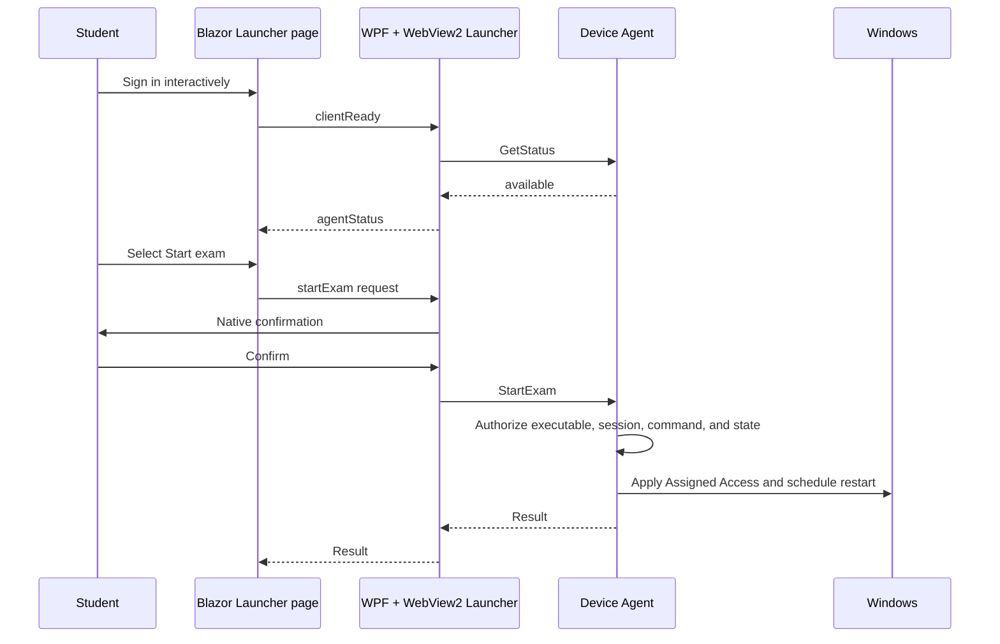

# Launcher WebView2 Implementation Plan

## Status

This document records the architecture decisions made for the next Exam Kiosk
prototype increment. It is an implementation handoff, not a description of
completed functionality.

The increment replaces only the normal-session Launcher's native content with
a centrally hosted user interface. The Restricted Client remains unchanged.
The existing fixed **Bogus exam** remains the only exam for this increment.

## Goals

- Render the Launcher UI from the deployed Exam Kiosk web application so its
  presentation can evolve without redeploying the Windows client.
- Authenticate the student interactively against one Microsoft Entra tenant.
- Preserve the existing local security boundary: web content requests a state
  change, while native code and the Device Agent enforce it.
- Keep browser state isolated and disposable so one student cannot inherit
  another student's authenticated web session.
- Establish Azure infrastructure for confidential web authentication without
  storing credentials in source control or deployment parameters.

## Non-goals

- Changing the Restricted Client to WebView2.
- Selecting or passing a real exam assignment.
- Adding student app roles or roster authorization.
- Passing identity, policy, URL, scripts, paths, or exam data to the Device
  Agent.
- Implementing signed, device-bound effective exam policies.
- Supporting external or federated identity-provider redirects.
- Adding a Key Vault private endpoint or App Service VNet integration.
- Replacing the current Device Agent named-pipe protocol.

## Runtime Architecture

The WPF Launcher remains a small, installed native shell. It hosts WebView2 and
loads an authenticated `/launcher` page from the deployed Exam Kiosk web app.
The page may request `startExam`, but it cannot access the named pipe or invoke
Windows operations directly.



The trust boundary is deliberate:

- The hosted UI requests a transition.
- The Launcher validates the request and requires native confirmation.
- The Device Agent independently authorizes and enforces the transition.
- A browser message or web response is never proof that the transition
  succeeded.

Do not expose the Device Agent through localhost HTTP. Continue using the
authenticated and executable-authorized named pipe.

## Web Application

Use the existing ASP.NET Core Blazor Web App as the host. Add an Interactive
WebAssembly client for the `/launcher` experience.

- Authentication is server-owned through `Microsoft.Identity.Web` and OpenID
  Connect.
- Use `AddMicrosoftIdentityWebApp`, not `AddMicrosoftIdentityWebApi`.
- The server uses a secure HTTP-only authentication cookie.
- Entra access and refresh tokens must not be stored in WebAssembly browser
  storage.
- Same-origin server calls use the protected session cookie.
- Server mutations require antiforgery protection.
- The WebAssembly UI can remain loaded during a brief server interruption.
- Keep the initial client bundle small because the ephemeral profile downloads
  it again on every Launcher run.
- Show a native loading or failure state while WebView2 initializes and the
  application loads.

The `/launcher` page continues to show the fixed **Bogus exam**. Any
authenticated account from the configured tenant may use the page during this
prototype increment. This is authentication only, not complete student
authorization.

## Microsoft Entra Registration

Create a dedicated app registration for Exam Kiosk Web.

- Supported account type: accounts in this organizational directory only.
- Application type: confidential web application.
- Authentication flow: Authorization Code flow with PKCE.
- Production callback:
  `https://app-<workload>-<environment>.azurewebsites.net/signin-oidc`.
- Local callback: `https://localhost:7136/signin-oidc`.
- No Microsoft Graph permissions are needed for this increment.
- App roles are deferred.

Add a focused local-development PowerShell bootstrap script that:

1. Creates or reuses the `Exam Kiosk Web - dev` single-tenant app registration.
2. Creates its service principal.
3. Adds the stable localhost callback.
4. Replaces only the prior local-development credential.
5. Outputs paste-ready `appsettings.Development.json` configuration.

The script must not access Key Vault, deploy Azure resources, or configure a
production callback. The ignored local settings file may contain its
development-only credential.

## Azure Ownership Boundaries

### Bicep

The Bicep deployment owns Azure Resource Manager resources and configuration:

- Resource group.
- Linux App Service plan.
- Linux App Service with system-assigned managed identity.
- Key Vault through an Azure Verified Module (AVM).
- Key Vault RBAC assignments.
- App Service settings, including the Key Vault reference.
- Non-secret `entraClientId` Bicep parameter.

Use AVM for Azure resources where an applicable module exists. Do not manage
Microsoft Graph directory objects from the ARM Bicep template.

### Deployment orchestration

`Deploy-ExamKioskWeb.ps1` coordinates operations that depend on Bicep outputs:

1. Create or reuse an app registration and service principal whose display name
   is suffixed with the requested environment.
2. Deploy Bicep and read the final web app URL and Key Vault name.
3. Add or retain the environment's `/signin-oidc` callback.
4. Check whether the Key Vault client-secret entry exists.
5. Create the initial Entra client credential only when the secret is absent.
6. Write the one-time credential value directly to Key Vault without printing
   it or persisting it to disk.
7. Retry the first Key Vault write for bounded RBAC propagation delays.
8. Deploy and verify the web app.

Do not rotate the credential on every deployment. Credential rotation will be
an explicit later operation that supports overlap between old and new
credentials.

## Azure Naming

Use the agreed deterministic CAF-style names:

```text
rg-<workload>-<environment>
asp-<workload>-<environment>
app-<workload>-<environment>
kv-<workload>-<environment>
```

For the current development environment:

```text
rg-examkiosk-dev
asp-examkiosk-dev
app-examkiosk-dev
kv-examkiosk-dev
```

Do not add `uniqueString` or another generated suffix. Uniqueness is owned by
the selected `workloadName` and `environment` parameter values. Changing the
existing hashed App Service name creates a replacement App Service because an
App Service cannot be renamed.

## Key Vault and RBAC

- Use the Key Vault AVM.
- Enable the RBAC authorization model; do not use legacy access policies.
- Keep public network access enabled for Phase 0.
- Do not add a private endpoint yet.
- Enable soft delete and purge protection.
- Assign `Key Vault Secrets User` at vault scope to the App Service's
  system-assigned managed identity.
- Assign `Key Vault Secrets Officer` at vault scope to
  `deployer().objectId`.
- Do not assume that `deployer()` is a human user; it may be a user, service
  principal, or managed identity.
- The deployer still requires permission to create role assignments, normally
  through Owner or User Access Administrator.

The App Service must use a versionless Key Vault reference for
`AzureAd__ClientSecret`, allowing explicit secret rotation without another App
Service configuration deployment.

Expected application settings:

```text
AzureAd__Instance     = https://login.microsoftonline.com/
AzureAd__TenantId     = <deployment tenant ID>
AzureAd__ClientId     = <entraClientId Bicep parameter>
AzureAd__CallbackPath = /signin-oidc
AzureAd__ClientSecret = @Microsoft.KeyVault(SecretUri=<versionless secret URI>)
```

For local development, paste the bootstrap script output into the ignored
`src\ExamKiosk.Web\appsettings.Development.json` file. Do not commit the
credential.

## Launcher Configuration

`Install-ExamKioskPoc.ps1` will require `-WebAppUrl` and write an
administrator-owned configuration file under:

```text
%ProgramFiles%\ExamKiosk\Launcher
```

Store only the absolute HTTPS base URL:

```json
{
  "webAppUrl": "https://app-examkiosk-dev.azurewebsites.net"
}
```

Validation requirements:

- Require an absolute HTTPS URL.
- Reject embedded credentials, query strings, fragments, and unexpected
  paths.
- Derive `/launcher` and the trusted origin locally.
- Rely on the administrator-owned `%ProgramFiles%` ACL; standard users must not
  be able to modify the configuration.
- Fail closed to a local error/retry experience if configuration is missing or
  invalid.

Using an explicit URL, rather than deriving it from workload and environment,
allows a later move to a custom district domain without changing the installer
contract.

## WebView2 Profile and Navigation

The Evergreen WebView2 Runtime is a managed-device prerequisite. The installer
must detect it and stop with an actionable error before changing the installed
prototype when it is absent. The prototype installer must not download it.

Use a dedicated ephemeral Launcher profile:

- Never share the normal Edge profile.
- Never share the future Restricted Client profile.
- Delete profile data before WebView2 initialization.
- Delete it again on normal Launcher exit.
- Startup deletion cleans leftovers after crashes.
- Temporary runtime storage while the Launcher is open is expected.

Harden the WebView2 shell:

- Accept bridge messages only when the source is the exact configured web app
  origin.
- Allow top-level navigation only to the web app origin and the Microsoft Entra
  sign-in authority at `https://login.microsoftonline.com`.
- Block external federation redirects during Phase 0.
- Cancel popups and new windows.
- Disable downloads, context menus, developer tools, browser extensions,
  autofill, and password saving.
- Present a native error/retry experience when loading or navigation fails.

Entra may use additional Microsoft-owned endpoints during a real sign-in. The
exact navigation allowlist must be verified against observed WebView2
navigation events and current Microsoft identity behavior before considering
the restriction complete. Do not weaken message-origin validation while doing
that compatibility work.

## Native Bridge Contract

Use a small, versioned, fixed message schema. The web page must never send
commands, scripts, executable paths, account names, XML, URLs, or arbitrary
agent arguments.

Initial handshake:

```json
{
  "version": 1,
  "type": "clientReady",
  "requestId": "<guid>"
}
```

The native Launcher queries `GetStatus` and returns a correlated result:

```json
{
  "version": 1,
  "type": "agentStatus",
  "requestId": "<guid>",
  "state": "available"
}
```

The Blazor **Start exam** control remains disabled until the native shell
reports `available`. Agent connectivity failures show a retry action. Other
agent states remain blocked. This status improves the UI only; the Device Agent
must still validate its current state when `StartExam` arrives.

Start request:

```json
{
  "version": 1,
  "type": "startExam",
  "requestId": "<guid>"
}
```

On a valid request from the trusted origin, the native Launcher:

1. Shows the existing native confirmation dialog.
2. Returns a correlated cancellation result if the student declines.
3. Calls the existing `AgentClient.SendAsync(AgentCommand.StartExam, ...)` if
   confirmed.
4. Returns a correlated accepted or failed result to the page.
5. Prevents duplicate in-flight transition requests.

The exact response fields should be shared between the Blazor client and WPF
Launcher through a small contract type where practical. Do not expose raw
exception details to the hosted UI.

## Security Properties to Preserve

- Web authentication does not authorize a local privileged transition by
  itself.
- The Launcher accepts only the small action vocabulary assigned to it.
- Native confirmation protects against accidental events and a compromised or
  cross-site-scripted hosted page.
- The Device Agent continues resolving and authorizing the caller executable
  and interactive session.
- The Launcher cannot request `FinishExam`.
- The hosted page cannot select PowerShell, XML, paths, accounts, or commands.
- Missing web service, authentication, configuration, runtime, or agent status
  leaves the device in the normal Windows session.

## Implementation Sequence

1. Add the focused Entra app-registration bootstrap script.
2. Update Bicep parameters, deterministic App Service naming, Key Vault AVM,
   RBAC assignments, managed identity settings, and identity app settings.
3. Extend the deployment script with production callback configuration and
   one-time client-credential bootstrap into Key Vault.
4. Add `Microsoft.Identity.Web`, server authentication, User Secrets support,
   and the hosted Interactive WebAssembly project.
5. Add the authenticated `/launcher` page with the fixed Bogus exam and native
   bridge JavaScript interop.
6. Replace only the WPF Launcher's native content with the hardened WebView2
   shell, native confirmation, status handshake, and ephemeral profile.
7. Update the installer with required `-WebAppUrl`, configuration writing, and
   WebView2 Runtime prerequisite validation.
8. Add focused tests, validate the Bicep template, build the solution, and run
   the existing and new tests.
9. Update the README and infrastructure documentation with bootstrap, local
   User Secrets, deployment, installation, and recovery instructions.

## Validation Plan

- App-registration script creates only the app and service principal, is
  single-tenant, and returns no secret.
- Bicep lint and validation succeed using the AVM modules.
- Resource names exactly follow the agreed convention.
- App Service identity can read the configured secret but cannot manage vault
  access or other Azure resources.
- The production callback is added without deleting the localhost callback.
- A normal redeployment does not rotate the Entra credential.
- The web app redirects an unauthenticated `/launcher` request to the configured
  tenant and returns to `/signin-oidc`.
- A tenant user can load the Bogus exam page after interactive sign-in.
- A direct browser cannot invoke the local agent.
- An untrusted-origin message cannot invoke `GetStatus` or `StartExam`.
- A trusted, malformed, unknown-version, or unknown-type message is rejected.
- Start remains disabled until the agent reports `available`.
- Declining native confirmation does not call the Device Agent.
- Confirming calls the existing named-pipe command exactly once.
- Missing WebView2 Runtime causes installation to stop before mutation.
- Missing or invalid Launcher configuration fails closed.
- Profile data is absent before the next Launcher session after normal exit and
  after recovery from a simulated prior crash.
- The existing Device Agent authorization and transition tests continue to
  pass.

## Deferred Decisions and Work

- `ExamKiosk.Student` app role and assignment-based authorization.
- Real exam discovery and assignment selection.
- Server-issued signed, short-lived, device-bound effective policy.
- Identity-to-device and assignment binding at the Device Agent boundary.
- Converting the Restricted Client to the same hosted UI pattern.
- Restricted Client `finishExam` bridge and native confirmation.
- External identity-provider federation compatibility.
- Credential rotation automation and overlap procedure.
- Custom district domains and associated callback changes.
- Key Vault private endpoint, App Service VNet integration, and private
  deployment agent.
- Offline application assets beyond the native loading and failure experience.